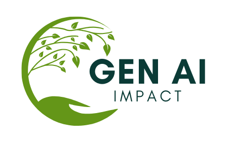

    

# Understand Generative AI Environmental Footprint

 
 
 

**[GenAI Impact](https://genai-impact.org)** is a non-profit dedicated to assessing and reducing the environmental impacts of generative AI, through open research, innovative tools and community engagement.

We develop:

* 🌱 **[EcoLogits](https://github.com/genai-impact/ecologits)**: A Python package to track the environmental impacts of using generative AI models through APIs (for OpenAI, Anthropic, Mistral AI, and more).

* 🧮 **[EcoLogits Calculator](https://huggingface.co/spaces/genai-impact/ecologits-calculator)**: A form-based estimator of LLM inference impacts based on EcoLogits, hosted on a Hugging Face Spaces.
